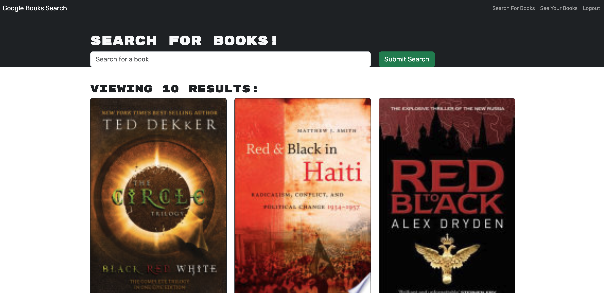

<div align="center">
<h1>
<span style="color:gold">MERN Book Search Engine</span> 
</h1>
<h2>Technologies Used</h2>


  
</div>

## Table of Contents

- [Description](#description)

- [User-Story](#user-story)

- [Live-URL](#live-url)

- [Screenshots](#screenshots)

- [Installation](#installation)

- [Challanges](#challanges)

- [Features](#features)

<!-- - [Usage-Information](#usage-information) -->

- [Suggested-Future-Development](#suggested-future-development)

- [Tests](#tests)

- [Contribution-Guidelines](#contribution-guidelines)

- [License](#license)

- [Credits](#credits)

- [Questions](#questions)

## Description 
This project was built using a starter code with a fully functioning Google Books API search engine built with a RESTful API. I have refactored it to be a GraphQL API built with Apollo Server. The app was built using the MERN stack with a React front end, MongoDB database, and Node.js/Express.js server and API. 

## User Story

```md
AS AN avid reader
I WANT to search for new books to read
SO THAT I can keep a list of books to purchase
```

## Live-URL

[Deployed Page with Heroku](https://calm-mountain-04138-c13f8ae81894.herokuapp.com/)

## Screenshots

<div align="center">



</div>
  
## Installation 

* Start server with command `npm run dev`.

## Challanges

Deploying to Heroku was a huge challenge! The main difficulity was figuring out how to connect MongoDB with Heroku. To do so you must start by setting up an account through the MongoDB Cloud Atlas. Navigate to the database access tab, giving MongoDB roles atlasAdmin access, set a password and then access the correct connection string by accessing through the database tab, the connect button, and through their accessing drivers, once there, copy the connection string, hop back over to Heroku and in your setting tab add Config Vars (key: MONGODB_URI, value: mongodb+srv://<username>:<password>@cluster0.ibn4vyk.mongodb.net/?retryWrites=true&w=majority) paste the connection string in for the value filling in your username and password in the appropriate locations.

## Features

Features of the site include Reacts ability to easily create a one page application that appears as though it is many pages. Users can easily navigate the site, search books using the implemented GoogleAPI, and save or delete books to their profile.

## Suggested Future Development

- Continued display and UI development
- Adding pages where users can interact with other users profiles 
- Including unit testing

## Tests
There are currently no unit testings written for this application.

## Contribution-Guidelines
Please follow Contributor Covenant Guidelines by clicking on the following link: 
*[Contributor Covenant](https://www.contributor-covenant.org/)*

## License
This project is covered under the MIT licence.  
To learn more click on the following *[link](https://opensource.org/licenses/MIT)*

##  Credits
Thank you for tips and sugestions from Bootcamp instructors and classmates. I have used the following tutorials 

https://www.freecodecamp.org

https://www.stackoverflow.com 

Some codes were based on mini project and some other modules from bootcamp. 

## Questions
Please visit my [GitHub Repo](https://github.com/Esztergb/book-search-engine) to view this project.
[Deployed Page](https://calm-mountain-04138-c13f8ae81894.herokuapp.com/)